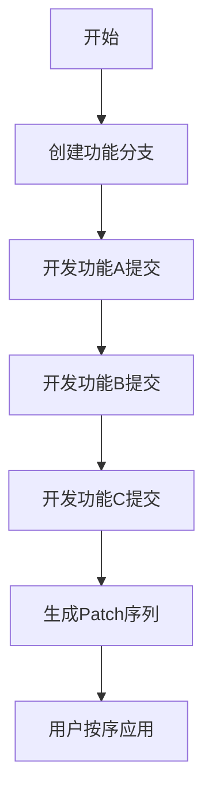
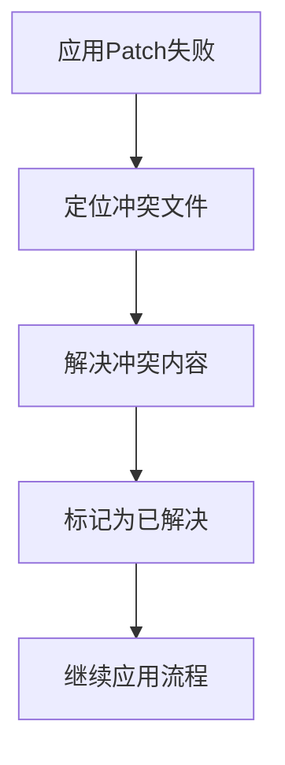

# 单分支开发与Patch管理完整指南

## 引言
本文档详细介绍了单分支开发模式下，如何高效管理功能迭代、生成Patch文件、处理问题提交，并提供给其他开发者同步方案版本控制。

## 核心工作流程



### 1. 基础开发流程

#### 1.1 初始化开发环境
```bash
# 基于main分支创建功能分支
git checkout main
git pull
git checkout -b feature-awesome
```

#### 1.2 功能开发与提交
```bash
# 开发功能点1
git add file1.js
git commit -m "功能A: 添加核心逻辑"

# 开发功能点2
git add file2.css
git commit -m "功能B: 添加样式实现"

# 开发功能点3
git add tests/
git commit -m "功能C: 添加单元测试"

```

#### 1.3 生成Patch文件包
```bash
# 获取基础提交ID
BASE_COMMIT=$(git rev-parse main)

# 生成patch序列
git format-patch ${BASE_COMMIT} -o feature-patches

# 保存基础版本信息
echo "基础版本: ${BASE_COMMIT}" > feature-patches/README.txt
echo "应用命令: git am feature-patches/*.patch" >> feature-patches/README.txt
```

#### 1.4 用户应用流程
```bash
# 1. 同步到基础版本
git checkout ${BASE_COMMIT}

git apply --check $1/*.patch && echo "✅ 补丁可安全应用" || echo "❌ 检测到冲突"
git apply --quiet *.patch
# 2. 应用所有patch
git am feature-patches/*.patch

# 3. 验证应用结果
git log --oneline  # 应显示所有功能提交
```

### 2. 迭代开发方案

当需要新增功能点时：


#### 2.1 添加新功能点
```bash
# 继续在原有分支开发
git checkout feature-awesome

# 添加新功能
git add new-feature.js
git commit -m "功能D: 扩展能力实现"
```

#### 2.2 重新生成Patch
```bash
# 重新生成全量patch(包含新功能)
git format-patch ${BASE_COMMIT} -o feature-patches-updated

# 添加版本标记
echo "v1.2 - 包含功能A/B/C/D" > feature-patches-updated/VERSION
```

### 3. 问题提交处理方案

#### 方案1: 交互式变基(未分发时推荐)
```bash
# 查看提交历史
git log --oneline
# a1b2c3d (HEAD) 功能C: 添加单元测试
# b5e72a9 功能B: 添加样式实现 ← 需要删除
# c2a8f1c 功能A: 添加核心逻辑
# 7e2d4f6 基础版本

# 启动交互式变基
git rebase -i HEAD~3

# 编辑变基列表
# 删除功能B的pick行，保存退出
```

#### 方案2: 生成反向补丁(已分发时推荐)
```bash
# 为问题提交生成反向补丁
git revert b5e72a9 --no-commit
git commit -m "REVERT: 回退功能B的提交"

# 生成反向补丁文件
git format-patch HEAD~1 -o revert-patches
```

#### 方案3: 选择性提交
```bash
# 创建清理分支
git checkout -b cleaned-feature ${BASE_COMMIT}

# 挑选正常提交
git cherry-pick c2a8f1c  # 功能A
git cherry-pick a1b2c3d  # 功能C
```

### 4. 冲突解决策略

当用户应用Patch遇到冲突时：



#### 解决步骤:
```bash
# 1. 查看冲突文件
git status

# 2. 手动编辑冲突文件
# 查找 <<<<<<< HEAD ... >>>>>>> 标记

# 3. 标记冲突解决
git add resolved-file.js

# 4. 继续应用
git am --continue
```

### 5. 自动化工具脚本

#### 5.1 Patch生成脚本
```bash
#!/bin/bash
# generate-patches.sh
BRANCH=$(git branch --show-current)
BASE_COMMIT=$(git merge-base main ${BRANCH})
PATCH_DIR="patches-${BRANCH}-$(date +%Y%m%d-%H%M%S)"

mkdir -p ${PATCH_DIR}
git format-patch ${BASE_COMMIT} -o ${PATCH_DIR}
echo "BASE_COMMIT=${BASE_COMMIT}" > ${PATCH_DIR}/config
echo "生成补丁包: ${PATCH_DIR}"
zip -r ${PATCH_DIR}.zip ${PATCH_DIR}
```

#### 5.2 Patch验证脚本
```bash
#!/bin/bash
# verify-patches.sh
if [ -z "$1" ]; then
  echo "用法: $0 <补丁目录>"
  exit 1
fi

BASE_COMMIT=$(grep '^BASE_COMMIT=' $1/config | cut -d'=' -f2)
git checkout ${BASE_COMMIT}
git am --check $1/*.patch && echo "✅ 补丁可安全应用" || echo "❌ 检测到冲突"
```

### 6. 最佳实践总结

| 场景 | 推荐方案 | 注意事项 |
|------|----------|----------|
| **日常开发** | 单分支线性提交 | 保持小步提交，功能点分离 |
| **功能迭代** | 重新生成全量Patch | 避免增量分发 |
| **问题修复(未分发)** | 交互式变基 | 会重写历史 |
| **问题修复(已分发)** | 反向补丁 | 保留原始历史记录 |
| **复杂冲突** | 手动解决+标记 | 使用三方对比工具 |
| **版本管理** | 包含README和VERSION | 明确说明内容 |

### 7. 完整工作流示例

**开发者:**
```bash
# 创建分支
git checkout -b new-widget-feature

# 功能开发
git add widget-core.js
git commit -m "组件核心功能"
git add widget-styles.css
git commit -m "组件样式"

# 发现问题样式提交
git log  # 找到样式提交ID

# 交互式变基删除问题提交
git rebase -i HEAD~2

# 重新生成patch
./generate-patches.sh
```

**用户:**
```bash
# 下载patch包
unzip new-widget-feature-patches.zip

# 准备环境
git checkout $(cat new-widget-feature/config | grep BASE_COMMIT | cut -d= -f2)

# 应用并验证
git am new-widget-feature/*.patch
npm test  # 运行测试验证
```

## 结论

单分支开发配合Patch管理提供了一种轻量级、高效率的代码分发方案：
1. 开发者通过`git format-patch`序列化工作成果
2. 用户通过`git am`精准重现开发历史
3. 问题处理采用三级策略适应不同场景
4. 自动化脚本简化重复操作

